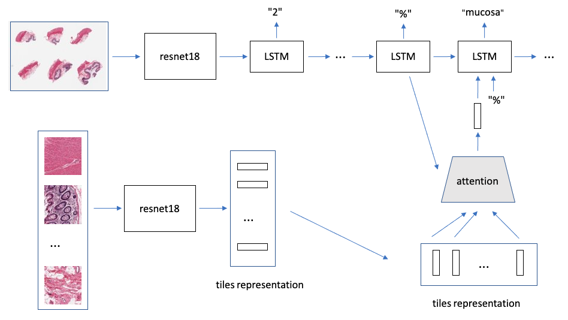
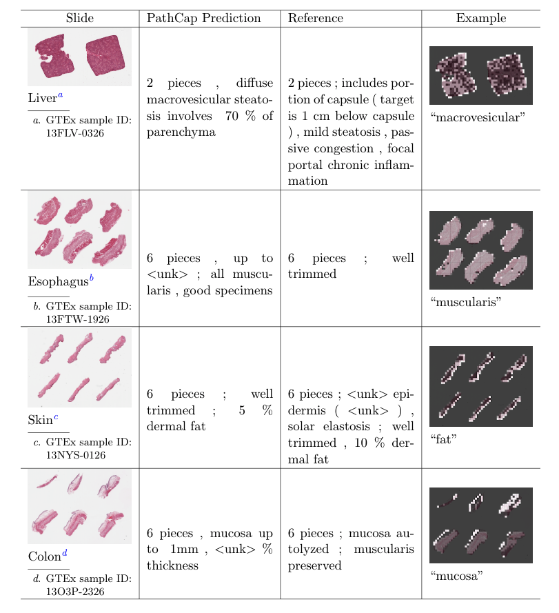

# PathCap

This is the repo for our paper

Evaluating and interpreting caption prediction forhistopathology images

- AE_triplet_loss/ contains codes for training autoencoder with triplet loss.
- att_thumbnail_tiles/ is model PathCap. It uses the thumbnail to init the LSTM and sampled tiles, one from each cluster, for each step of LSTM. Some codes (the decoder part) are borrowed from https://github.com/sgrvinod/a-PyTorch-Tutorial-to-Image-Captioning. The codes for generating the visualization figs with attention weights are also inside this category.
- att_tiles/ is model which uses tiles only. 
- cluster/ contains scripts for doing K-Mean clustering.
- data/ preprocesses the images and captions.

## Prerequisites
- PyTorch-1.0 
- NLTK-3.5
- tensorboardX-2.1

## Model Architecture 

## Visualization

Visualization of the PathCap method on four test slides from four different tissues.The last column shows some examples of attention weights when the model generates the corresponding tokens.  White/bright indicates more attention weight,black/dark indicates less attention weight. We observe the model attends at word-level to both the inner parts of the tissue or texture and also the boundaries, depending on the caption context.
